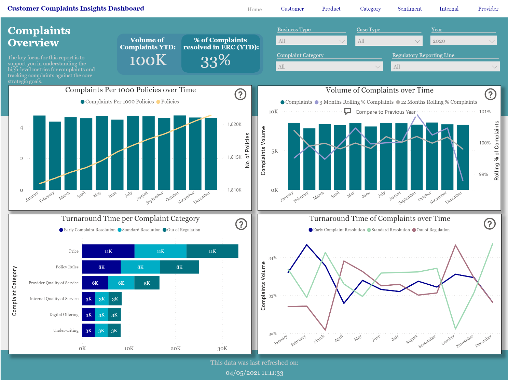
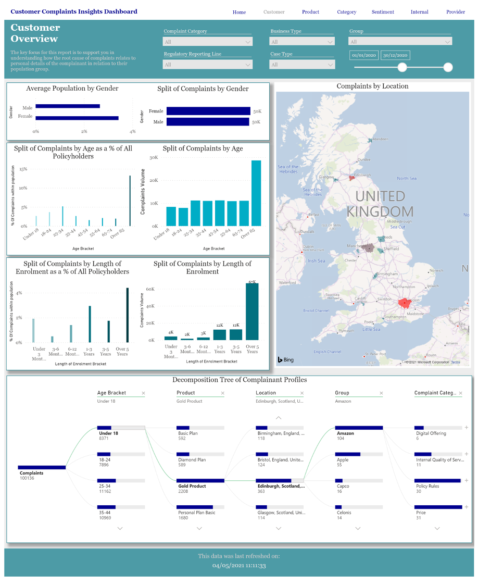
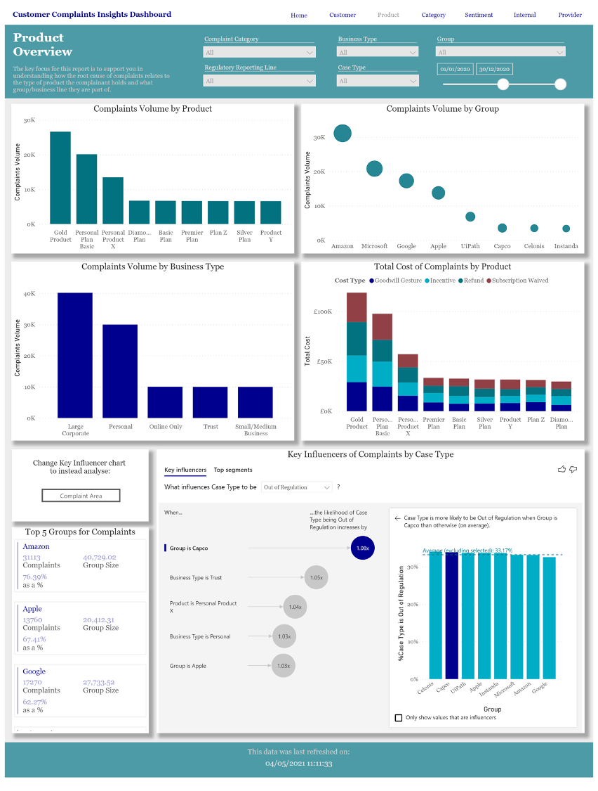
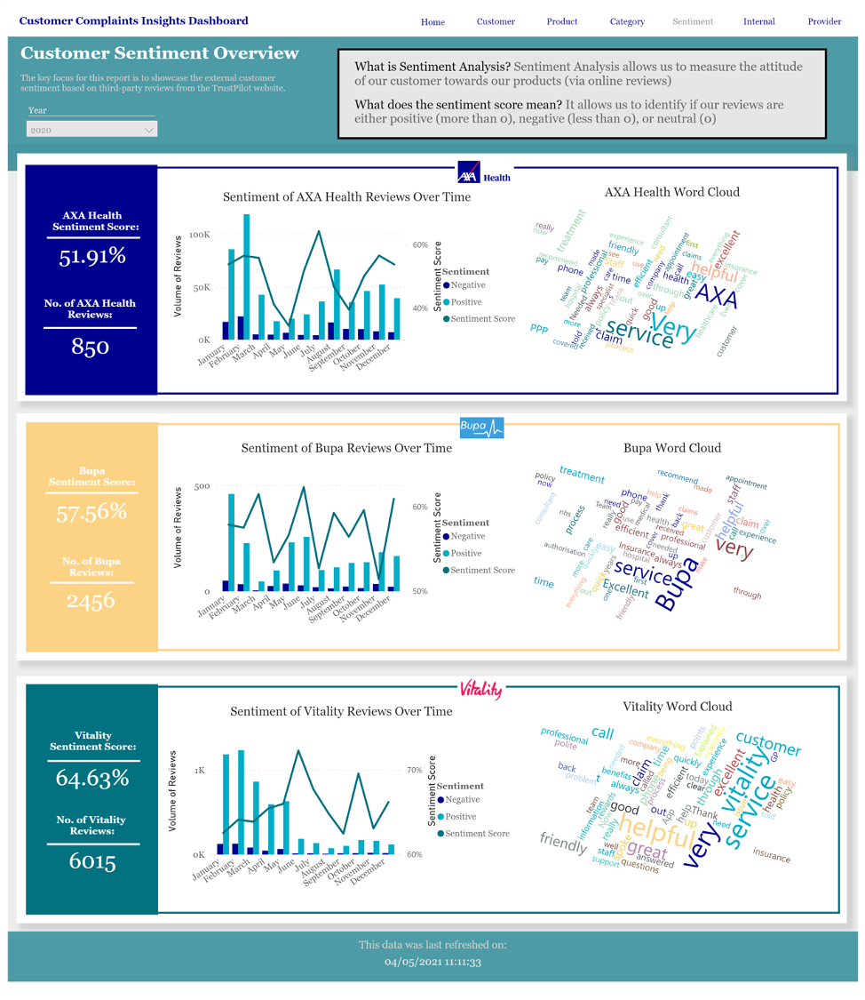

# Beautiful PBI Dashboard Design
This repository contains a **sanitised** version of a Power BI dashboard I built for a client in a regulated industry.

## The dashboard screens
### Home Page: 

The above screen was designed to be the main page for Senior Leadership. This includes C level executives who only want to track key KPIs. 
Key features included:
- Custom DAX to calculate 'per 1000 policies' and rolling percentage
- Python algorithm to calculate customer population over time 

### Customer Insights page: 

This page focused on showing details on our clients customers. 
Key features:
- Ability to not just look at row volume counts, but also as a proportion of the entire population at the time being looked at (selected via the filter)
- A decomposition tree allowed for ad-hoc questions to be answered

### Large Clients Insights page: 

This page focused on sharing details on corporate customers.
Key features:
- Ability to see volume as a percentage of the corporate customer size
- Key influencer chart that highlighted key segments and points of interest

### Sentiment Analysis page:

This page combined sentiment captured from APIs from large third party review sites (e.g. trustpilot etc)
Key features:
- Compare the sentiment over time against key competitors

## Design
The design compliments internal style guides whilst aligning with the external website.

## What is not included in the sanitised version
As this is a sanitised dashboard, **it does not have all the functionality and features built for the client**. 

To find out more, please contact me via an email.
